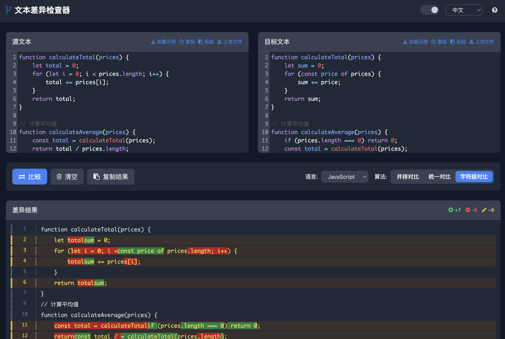

# DiffChecker 文本差异检查器

一个现代化、功能强大的文本差异检查工具，支持多种编程语言语法高亮和多种对比算法。

## ✨ 特性

- 🎨 **现代化 UI** - 采用 Tailwind CSS 设计，支持深色/浅色主题切换
- 🌐 **多语言支持** - 支持中文和英文界面
- 📝 **代码编辑器** - 集成 CodeMirror 编辑器，支持语法高亮
- 🔧 **多种对比算法**：
  - 并排对比 (Side by Side) - 左右并排显示差异
  - 统一对比 (Unified) - 合并显示差异结果
  - 字符级对比 (Character Level) - 精确到字符的差异检测
- 🎯 **语言支持** - 支持多种编程语言语法高亮：
  - Markdown, JavaScript, Python, HTML/XML
  - CSS, SQL, Java, C/C++, Shell
  - YAML, Dockerfile 等
- 📁 **文件操作** - 支持文件上传、拖拽和示例加载
- 📋 **剪贴板功能** - 一键复制粘贴文本内容
- 📊 **统计信息** - 实时显示新增、删除、修改行数统计
- 🚀 **性能优化** - 高效的差异算法，支持大文件比较

## 🌐 在线演示

[点击这里查看在线演示](https://linxueyuanstdio.github.io/DiffChecker/)

## 📸 截图



## 🚀 快速开始

### 在线使用

直接访问 [在线版本](https://linxueyuanstdio.github.io/DiffChecker/) 即可开始使用。

### 本地部署

1. **克隆仓库**
   ```bash
   git clone https://github.com/LinXueyuanStdio/DiffChecker.git
   cd DiffChecker
   ```

2. **启动服务**
   ```bash
   # 使用 Python 启动本地服务器
   python -m http.server 8000

   # 或使用 Node.js
   npx serve .

   # 或使用任何其他静态文件服务器
   ```

3. **访问应用**
   打开浏览器访问 `http://localhost:8000`

## 📖 使用方法

### 基本使用

1. **输入文本**
   - 在左侧"源文本"框中输入或粘贴原始文本
   - 在右侧"目标文本"框中输入或粘贴修改后的文本

2. **选择语言**
   - 从语言下拉菜单中选择对应的编程语言以启用语法高亮

3. **选择对比算法**
   - **并排对比**：左右并排显示两个文本，差异部分高亮显示
   - **统一对比**：将两个文本合并显示，差异部分用不同颜色标记
   - **字符级对比**：不仅检测行差异，还检测每行内的字符级差异

4. **查看结果**
   - 点击"比较"按钮查看差异结果
   - 查看统计信息了解变更概览

### 高级功能

- **文件上传**：点击"上传文件"按钮直接加载本地文件
- **拖拽支持**：将文件直接拖拽到编辑器区域
- **示例加载**：点击"加载示例"快速体验功能
- **主题切换**：支持深色和浅色主题
- **多语言界面**：支持中英文界面切换

## 🎨 颜色标识

- 🟢 **绿色** - 新增内容
- 🔴 **红色** - 删除内容
- 🟡 **黄色** - 修改内容
- ⚪ **灰色** - 上下文内容

## 🛠️ 技术栈

- **前端框架**: 纯 HTML/CSS/JavaScript
- **UI 框架**: [Tailwind CSS](https://tailwindcss.com/)
- **编辑器**: [CodeMirror 5](https://codemirror.net/)
- **图标**: [Font Awesome 4](https://fontawesome.com/v4.7.0/)
- **差异算法**: 自实现的文本差异算法

## 📁 项目结构

```
DiffChecker/
├── index.html          # 主页面文件
├── README.md          # 项目说明文档
└── LICENSE           # 开源协议
```

## 🌟 支持的文件格式

- **文本文件**: `.txt`, `.md`
- **Web 技术**: `.html`, `.css`, `.js`, `.ts`, `.jsx`, `.tsx`
- **编程语言**: `.py`, `.java`, `.c`, `.cpp`, `.go`, `.rs`, `.php`, `.rb`
- **配置文件**: `.json`, `.xml`, `.yaml`, `.yml`
- **脚本文件**: `.sh`, `.sql`
- **框架文件**: `.vue`, `.svelte`

## 🤝 贡献指南

欢迎贡献代码！请遵循以下步骤：

1. Fork 本仓库
2. 创建特性分支 (`git checkout -b feature/AmazingFeature`)
3. 提交更改 (`git commit -m 'Add some AmazingFeature'`)
4. 推送到分支 (`git push origin feature/AmazingFeature`)
5. 开启 Pull Request

## 📝 更新日志

### v1.0.0 (2025-07-14)
- ✨ 初始版本发布
- 🎨 现代化 UI 设计
- 🔧 支持三种对比算法
- 🌐 多语言界面支持
- 📁 文件上传和拖拽功能

## 📄 开源协议

本项目基于 [MIT License](LICENSE) 开源协议。

## 🙏 致谢

- [Tailwind CSS](https://tailwindcss.com/) - 现代化 CSS 框架
- [CodeMirror](https://codemirror.net/) - 强大的代码编辑器
- [Font Awesome](https://fontawesome.com/) - 优秀的图标库

## 📞 联系方式

如有问题或建议，请通过以下方式联系：

- GitHub Issues: [提交问题](https://github.com/LinXueyuanStdio/DiffChecker/issues)
- Email: your-email@example.com

---

⭐ 如果这个项目对你有帮助，请给它一个 Star！
